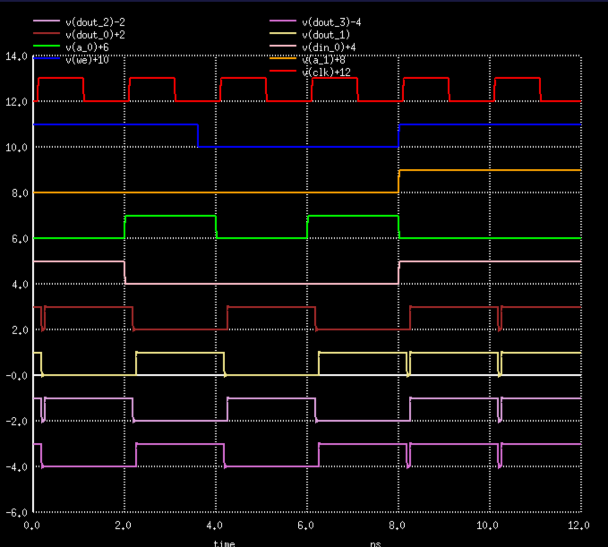
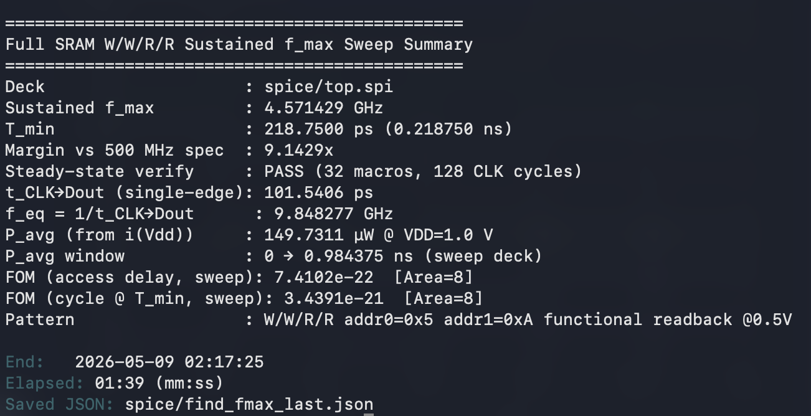
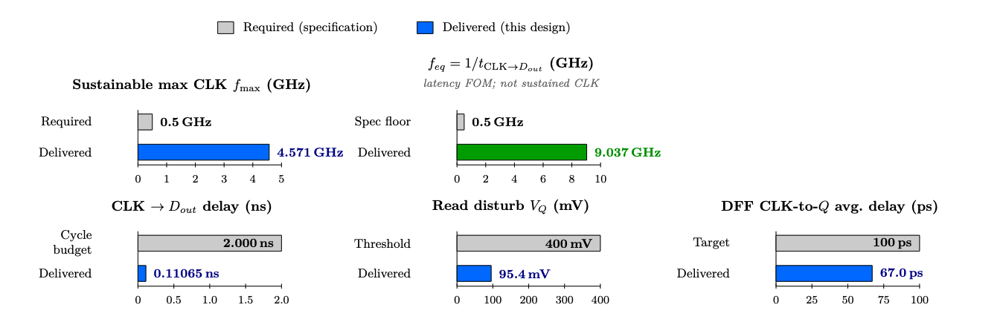
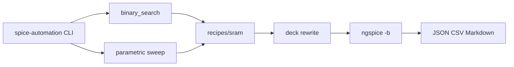
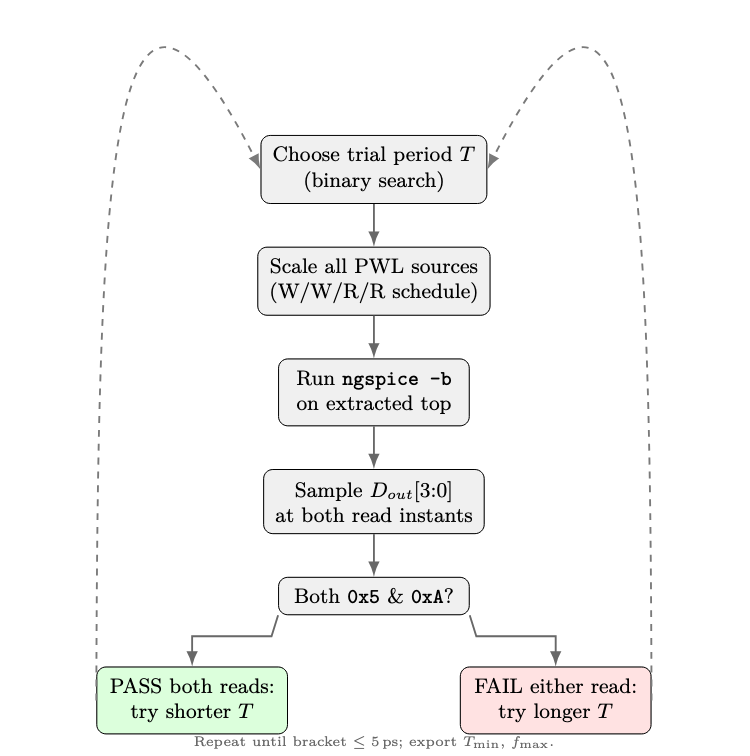

# SPICE Automation Framework

[](https://www.python.org/)
[](http://ngspice.sourceforge.net/)
[](https://opensource.org/license/mit)
[](https://github.com/tmarhguy/64b-sram)
[](https://www.engineering.upenn.edu/~ese3700/)

A Python pipeline that drives iterative **NGSpice** simulation runs, parses structured `.meas` output, converges on sustained **fmax** via binary search, and runs parametric design-space sweeps with comparative **PPA** reports. Generic machinery lives in `spicelab/`; circuit-specific stimulus and readback checks live in `recipes/`.


<p align="center">
  
</p>

<p align="center"><em>Top-level validation: writes then reads <code>0x5</code> and <code>0xA</code> — from <a href="examples/64b-sram/">64b-sram</a></em></p>


The proof circuit is a full-custom **16×4 SRAM macro** ([`examples/64b-sram`](examples/64b-sram), ESE 3700 Proj2) that originally shipped with hardcoded C++ and Python tooling. This framework pulls that optimization loop out of the project repo and formalizes it — so the next deck, course, or research spin does not start from scratch. The [design journal](https://tmarhguy.com/writing/#writing-spice-automation) is where the origin story lives; this README is the map.


---

## Why SPICE Automation

SPICE Automation is intentionally a **workflow machine**. Every odd choice is documented somewhere in the [design journal](https://tmarhguy.com/writing/#writing-spice-automation) — what was tried on the bench, what broke the iteration loop, what got pulled out of a course repo and generalized. If you love silicon because you like *measuring* it, not just drawing it, that journal is the real entry point. Start with [Formalizing the SPICE Automation Framework](https://tmarhguy.com/writing/2026-07-07-formalizing-the-spice-automation-framework/).

<p align="center">
  
</p>

<p align="center"><em><code>spice-automation fmax</code> on shipped <code>top.spi</code> — sustained <strong>4.571 GHz</strong>, <strong>9.14×</strong> vs 500 MHz spec, steady verify PASS.</em></p>

**It started in [ESE 3700](https://www.engineering.upenn.edu/~ese3700/).** Months ago (Spring 2026), the [16×4 full-custom 6T SRAM](https://github.com/tmarhguy/64b-sram) macro and the [8-bit ripple-carry adder](https://github.com/tmarhguy/full-adder) both needed custom C++ and Python tooling to verify speed and PPA metrics. The course required a minimum speed of **500 MHz**. After deep optimization — and verifying functional readbacks in NGSpice — the SRAM hit a **9× margin**, pushing the macro to **4.571 GHz** sustained. But extracting those metrics relied on heavily hardcoded scripts thrown together just to get through the iterations.

**The runner is not the recipe.** `find_fmax.py` and `opt_fmax.cpp` lived inside the SRAM repo because that is where the pain was. The framework decouples the generic runner from circuit-specific recipes: deck rewriting, NGSpice subprocess orchestration, binary search, and report generation are reusable; W/W/R/R stimulus patterns and functional readback checks stay in `recipes/sram/`.

**Model paths should not live in version control.** Instead of hardcoding predictive 22 nm HP model paths into every SPICE deck, the framework intercepts the deck and dynamically rewrites `.include` lines at runtime via `SPICE_MODEL_PATH`. Original circuit files stay clean for CI/CD.

**PPA should land structured.** The framework parses `.meas` extractions, calculates custom Figure of Merit formulas (like `60 × Area × Power × Delay²`), and writes comparative results directly into **JSON**, **CSV**, and **Markdown** reports.

**Width-scale sweeps generalize the old C++ loop.** Parametric sweeps that used to live in [`opt_fmax.cpp`](examples/64b-sram/spice/opt_fmax.cpp) now run concurrently from Python — scout pass, finalist verification, CSV output.

---

## Table of Contents

- [Why SPICE Automation](#why-spice-automation)
- [Proof circuit results](#proof-circuit-results)
- [Architecture at a glance](#architecture-at-a-glance)
- [Source of truth](#source-of-truth)
- [Repository map](#repository-map)
- [Quick start](#quick-start)
- [CLI](#cli)
- [Example circuits](#example-circuits)
- [Development](#development)
- [Documentation index](#documentation-index)
- [License](#license)
- [Author](#author)

---

## Proof circuit results

Headline numbers from the SRAM proof circuit ([`examples/64b-sram`](examples/64b-sram)). Pattern: **W/W/R/R** with `addr0=0x5`, `addr1=0xA` @ **0.5 V** VDD. Width-scale sweeps (0.50–1.00) all reproduced the same ~4.57 GHz closure — the limiter is the shared cycle envelope, not a single cell tweak.

| Metric | Value | Notes |
|--------|-------|-------|
| Sustained **fmax** | **4.571 GHz** | Binary search on CLK period, W/W/R/R pattern |
| Spec margin | **9.14×** vs 500 MHz | `fmax / 0.5 GHz` |
| Min CLK period | **218.75 ps** | At sustained closure |
| CLK → DOUT delay | **110.65 ps** | `@0.5 V` functional readback |
| Avg power | **21.37 µW** | Over 0.984 ns measurement window |
| **FOM** (access sweep) | **≈ 1.26×10⁻²²** | `60 × Area × Power × Delay²` |
| Steady-state verify | **PASS** | 32 macros, 128 CLK cycles, 64 readback checks |

Artifacts: [`reports/sram_fmax_baseline.json`](reports/sram_fmax_baseline.json), [`reports/sram_sweep_results.csv`](reports/sram_sweep_results.csv), [`reports/sram_comparison.md`](reports/sram_comparison.md).

<p align="center">
  
</p>

<p align="center"><em>Required vs. delivered headline metrics (from the SRAM LaTeX report).</em></p>

---

## Architecture at a glance

### Pipeline



### Generic vs. recipe layers

| Layer | Path | Responsibility |
|-------|------|----------------|
| CLI | [`spicelab/cli.py`](spicelab/cli.py) | `fmax`, `sweep`, `report compare` commands |
| Deck rewrite | [`spicelab/deck.py`](spicelab/deck.py) | `.include` path injection, L=1 width scaling |
| NGSpice runner | [`spicelab/ngspice.py`](spicelab/ngspice.py) | Subprocess batch execution |
| Binary search | [`spicelab/search.py`](spicelab/search.py) | Period convergence for sustained fmax |
| Parse / FOM | [`spicelab/parse.py`](spicelab/parse.py), [`fom.py`](spicelab/fom.py) | `.meas` extraction, FOM formulas |
| Sweep | [`recipes/sram/sweep.py`](recipes/sram/sweep.py) | Scout + finalist width-scale sweeps |
| Reports | [`spicelab/report.py`](spicelab/report.py) | JSON, CSV, Markdown output |
| SRAM recipe | [`recipes/sram/`](recipes/sram/) | W/W/R/R PWL stimulus, readback checks, config |

The SRAM recipe migrated from [`find_fmax.py`](examples/64b-sram/spice/find_fmax.py). The width-scale sweep generalizes [`opt_fmax.cpp`](examples/64b-sram/spice/opt_fmax.cpp).

<p align="center">
  
</p>

<p align="center"><em>Original <code>find_fmax.py</code> search flow — now the <code>recipes/sram</code> evaluation path.</em></p>

### fmax search loop

1. Rewrite deck `.include` paths from `SPICE_MODEL_PATH`.
2. Generate cycle-scaled PWL stimulus (W/W/R/R pattern).
3. Run NGSpice batch simulation.
4. Parse `.meas` results and check functional readback at 0.5 V.
5. Binary-search CLK period until sustained closure.
6. Optional steady-state verify (32 macro cycles, 128 CLK edges).

---

## Source of truth

| Layer | Authority | Consumers |
|-------|-----------|-----------|
| Circuit netlists | [`examples/*/spice/`](examples/) (git submodules) | Deck rewrite, simulation |
| SRAM recipe config | [`recipes/sram/config.yaml`](recipes/sram/config.yaml) | `fmax`, `sweep` commands |
| Process model | `SPICE_MODEL_PATH` env var (not committed) | Runtime `.include` rewrite |
| Committed reports | [`reports/`](reports/) | Resume artifacts, regression baselines |
| Design journal | [tmarhguy.com/writing](https://tmarhguy.com/writing/#writing-spice-automation) · [`log/`](log/) | Origin story, framework decisions |

**Policy:** Submodule decks are editable source. The framework rewrites model paths and width scales at runtime — never commit proprietary model cards. See [`models/README.md`](models/README.md).

---

## Repository map

```
spice-automation/
├── spicelab/     # Generic runner: deck, ngspice, search, parse, fom, sweep, report
├── recipes/
│   └── sram/             # SRAM recipe: evaluate, sweep, PWL, config
├── examples/
│   ├── 64b-sram/         # Proof circuit (submodule) — 16×4 SRAM, ESE 3700 Proj2
│   └── full-adder/       # Future recipe (submodule) — 8b ripple-carry adder
├── reports/              # Committed JSON/CSV/Markdown artifacts
├── media/                # Hero figures (copied from submodule media/)
├── scripts/              # Demo and helper scripts
├── models/               # Model card setup notes (no committed .pm files)
├── tests/                # Unit tests (deck rewrite, parse, search)
├── log/                  # Design journal (Obsidian vault)
└── .github/workflows/    # CI + optional NGSpice regression
```

---

## Quick start

```bash
git clone --recurse-submodules https://github.com/tmarhguy/spice-automation.git
cd spice-automation

# Model card (not redistributed — see models/README.md)
export SPICE_MODEL_PATH=/path/to/22nm_HP.pm

# NGSpice: brew install ngspice  (macOS)
pip install -e ".[dev]"

# One-command demo
./scripts/run-sram-demo.sh
```

---

## CLI

```bash
# Binary-search sustained fmax
spice-automation fmax --json-out reports/sram_fmax_baseline.json

# Parametric width-scale sweep (scout + finalists)
spice-automation sweep --csv-out reports/sram_sweep_results.csv

# Markdown comparison from CSV
spice-automation report compare \
  --csv reports/sram_sweep_results.csv \
  --out reports/sram_comparison.md
```

Or via module:

```bash
python3 -m spicelab.cli fmax --format pretty
```

---

## Example circuits

Proof and future recipes are git submodules under [`examples/`](examples/). Schematics, SPICE decks, course reports, and figures live in each submodule's own README — not duplicated here.

| Submodule | Framework recipe | README |
|-----------|------------------|--------|
| [`64b-sram`](examples/64b-sram/) | [`recipes/sram/`](recipes/sram/) (active) | [examples/64b-sram/README.md](examples/64b-sram/README.md) |
| [`full-adder`](examples/full-adder/) | planned | [examples/full-adder/README.md](examples/full-adder/README.md) |

See [examples/README.md](examples/README.md) for clone/update commands.

---

## Development

```bash
pytest -q
```

CI runs unit tests on every push. Full NGSpice regression is available via **Actions → Regression** (`workflow_dispatch`) when `SPICE_MODEL_PATH` secret is configured.

---

## Documentation index

| Resource | Content |
|----------|---------|
| [Design journal](https://tmarhguy.com/writing/#writing-spice-automation) | Published build log — start with [Formalizing the SPICE Automation Framework](https://tmarhguy.com/writing/2026-07-07-formalizing-the-spice-automation-framework/) |
| [`log/`](log/) | Obsidian vault mirror (local drafts) |
| [examples/README.md](examples/README.md) | Submodule index |
| [reports/README.md](reports/README.md) | Committed pipeline artifacts |
| [models/README.md](models/README.md) | Process model card setup |

---

## License

SPICE Automation is licensed under **[MIT](LICENSE)**.

---

## Author

**Tyrone Marhguy** — Computer Engineering '28, [University of Pennsylvania](https://www.upenn.edu/) · [ESE 3700](https://www.engineering.upenn.edu/~ese3700/)

[](mailto:tmarhguy@gmail.com)
[](mailto:tmarhguy@engineering.upenn.edu)
[](https://twitter.com/marhguy_tyrone)
[](https://instagram.com/tmarhguy)
[](https://substack.com/@tmarhguy)
[](https://github.com/tmarhguy)
[](https://www.upenn.edu/)
[](https://www.upenn.edu/)
[](https://www.engineering.upenn.edu/~ese3700/)
