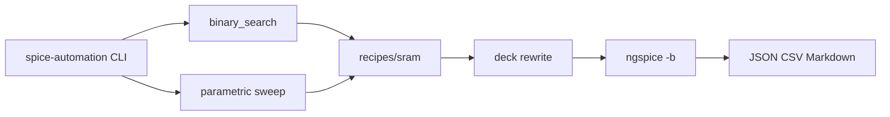

# SPICE Automation Framework

Python pipeline that drives iterative NGSpice simulation runs, parses structured output, converges on **F_max** via binary search, and runs parametric design-space sweeps with comparative PPA reports.

Proof circuit: [64b-sram](examples/64b-sram) (16×4 SRAM, ESE 3700 Proj2) linked as a git submodule.

## Resume-aligned results (SRAM)

| Metric | Value | How computed |
|--------|-------|----------------|
| Sustained **f_max** | **4.571 GHz** | Binary search on CLK period, W/W/R/R pattern |
| Spec margin | **9.14×** vs 500 MHz | `f_max / 0.5 GHz` |
| **FOM** | **≈ 1.26×10⁻²²** | `60 × Area × Power × Delay²` |
| Steady verify | PASS (32 macros) | 128 CLK cycles functional readback |

Artifacts: [`reports/sram_fmax_baseline.json`](reports/sram_fmax_baseline.json), [`reports/sram_sweep_results.csv`](reports/sram_sweep_results.csv).

## Architecture



Generic machinery lives in `spice_automation/`. SRAM-specific stimulus and readback checks live in `recipes/sram/` (migrated from [`find_fmax.py`](examples/64b-sram/spice/find_fmax.py)). The width-scale sweep generalizes [`opt_fmax.cpp`](examples/64b-sram/spice/opt_fmax.cpp).

## Quick start

```bash
git clone --recurse-submodules https://github.com/tmarhguy/spice-automation.git
cd spice-automation

# Model card (not redistributed — see models/README.md)
export SPICE_MODEL_PATH=/path/to/22nm_HP.pm

# NGSpice: brew install ngspice  (macOS)
pip install -e ".[dev]"

# One-command demo
./scripts/run-sram-demo.sh
```

## CLI

```bash
# Binary-search sustained f_max
spice-automation fmax --json-out reports/sram_fmax_baseline.json

# Parametric width-scale sweep (scout + finalists)
spice-automation sweep --csv-out reports/sram_sweep_results.csv

# Markdown comparison from CSV
spice-automation report compare \
  --csv reports/sram_sweep_results.csv \
  --out reports/sram_comparison.md
```

Or via module:

```bash
python3 -m spice_automation.cli fmax --format pretty
```

## Example circuits (submodules)

| Path | Repo | Role |
|------|------|------|
| `examples/64b-sram/` | [64b-sram](https://github.com/tmarhguy/64b-sram) | Primary proof — f_max + FOM |
| `examples/full-adder/` | [full-adder](https://github.com/tmarhguy/full-adder) | Future recipe — delay/energy metrics |

See [examples/readme.md](examples/readme.md).

## Development

```bash
pytest -q
```

CI runs unit tests on every push. Full NGSpice regression is available via **Actions → Regression** (`workflow_dispatch`) when `SPICE_MODEL_PATH` secret is configured.

## License

MIT
